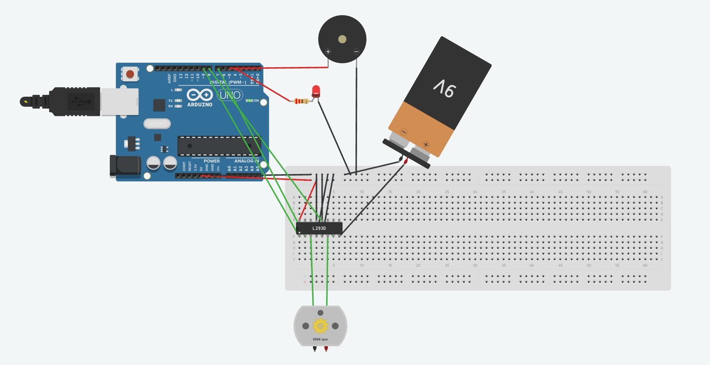

# Electronics

## Projects

### 1. Washing Machine Motor Controller
Arduino setup simulating a washing machine motor cycle: bidirectional DC motor control via L293D H-bridge, with PWM speed ramping, LED status indicator, and buzzer alert on cycle completion.

**Stack:** Arduino (C++)

### 2. 4-Function Calculator
Arduino calculator with a 4x4 keypad and 16x2 LCD display. Implements a shunting-yard expression parser for correct operator precedence for whole numbers. Includes dynamic I2C address scanning, division-by-zero error handling, and result chaining.

**Stack:** Arduino (C++)

